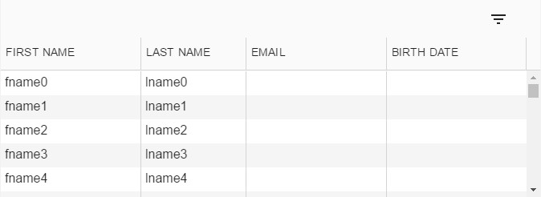

# xp-components
  Components based on angular-materials.

## NOTICE - Under Development
This framework is not ready for production. Use at your own risk.

## Installation

```shell
bower install --save xp-components
```

Then add a `<script>` to your `index.html`:

```html
  <link rel="stylesheet" type="text/css" href="/bower_components/angular-ui-grid/ui-grid.css">
  <link rel="stylesheet" type="text/css" href="/bower_components/angular-material/angular-material.css">
  <link rel="stylesheet" type="text/css" href="/bower_components/angular-material-icons/angular-material-icons.css">
  <link rel="stylesheet" type="text/css" href="/bower_components/xp-components/dist/xp-components.css">

  <script src="/bower_components/angular-ui-grid/ui-grid.js"></script>
  <script src="/bower_components/angular-material/angular-material.js"></script>
  <script src="/bower_components/angular-material-icons/angular-material-icons.js"></script>
  <script src="/bower_components/rxjs/dist/rx.lite.js"></script>
  <script src="/bower_components/xp-components/dist/xp-components.js"></script>
```

Once you have all the necessary assets installed, add `xp.components` as a dependency for your app:

```js
  angular.module('myApp', ['xp.components']);
```

## xp-autocomplete

This is a simple wrapper around then
[md-autocomplete](https://material.angularjs.org/latest/demo/autocomplete)
directive of angular-material.

### example
```html
<xp-autocomplete xp-items="item in items" xp-item-text="item.display"></xp-autocomplete>
```

## xp-grid

Wraps the [angular ui-grid](http://ui-grid.info/) and give it a "material design" look.

### example



Declare the xp-grid in html:
```html
<xp-grid xp-grid-options="options"></xp-grid-options>
```

Configure the columns and the fetch function in the controller:
```js
  .controller('myController', ['$scope', '$http', function ($scope, $http) {
      $scope.options = {
            columnDefs: [
                { field: 'firstName', displayName: 'First Name', width: "*", resizable: false },
                { field: 'lastName', displayName: 'Last Name', width: "20%" },
                { field: 'email', displayName: 'email', width: "*" },
                { field: 'birthDate', displayName: 'Birth Date', width: "*", filterType: 'date' }
            ],
            fetch: function (params) {
                return $http({ url: '/api/users', params }).then(e => e.data);
            }
        };
  }]);
```

## License

The MIT License